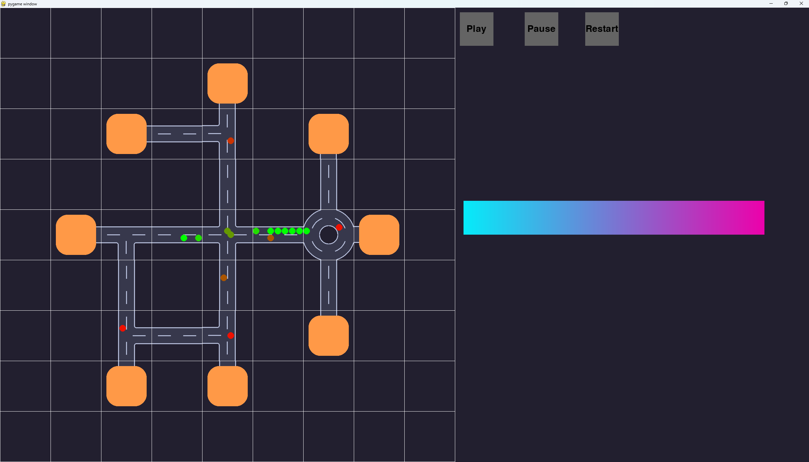
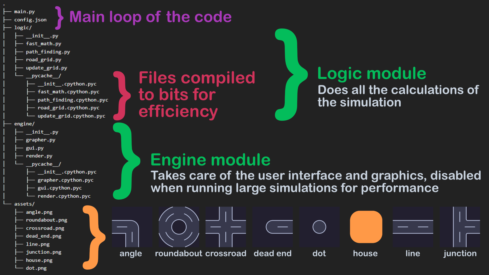
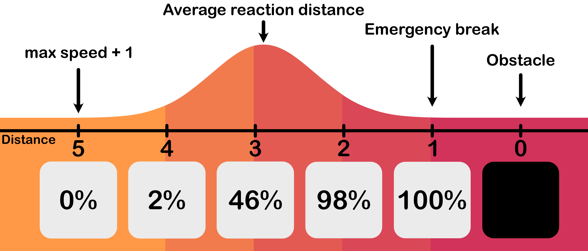

# Traffic Flow Simulation



## Overview

This project provides a detailed simulation of traffic flow using **cellular automata**, incorporating human-like braking behaviors and a graphical user interface for 2D layouts. The software models traffic phenomena such as jams, synchronized flows, and free flows. It supports interactive visualization and high-performance batch simulations.

---

## Features

- **Interactive Interface**: Design road layouts and observe traffic in real-time using `pygame`.
- **Flexible Configuration**: Adjust parameters like grid size, car count, reaction times, and more via a `config.json` file.
- **Multithreaded Simulations**: Run multiple simulations simultaneously without graphical rendering for faster results.
- **Human-like Braking**: Probabilistic reaction times based on car spacing.
- **Detailed Analysis**: Outputs performance metrics to assess layout efficiency.

---

## How It Works

### Graphical Interface and Simulation


- Users can create layouts with roads, roundabouts, and houses (orange blocks). Roads automatically connect, forming intersections.
- Traffic behavior dynamically adapts to the layout, simulating congestion and flow in real-time.

---

### Code Structure


- **Logic Module**: Handles simulation rules, pathfinding, and grid updates.
- **Engine Module**: Manages the graphical interface and rendering (disabled in batch simulations for performance).
- **Assets Folder**: Contains visual components like road and house images.
- **Main Loop**: Executes the program’s central processes.

---

### Reaction Time Mechanism


The reaction probability is determined by the car’s distance to obstacles:
- **Distance = 5**: No reaction (0% probability).
- **Distance = 3**: 46% probability of reacting.
- **Distance = 1**: 100% probability of stopping or slowing down.

This probabilistic model mimics human-like braking behavior.

---

## Configuration

Modify the `config.json` file to customize the simulation:
```json
{
    "height": 520,
    "grid_size": 9,
    "fps": 10,
    "car_count": 1000,
    "average_speed": 7,
    "uncertainty_speed": 0.2,
    "range_speed": 0,
    "average_departure": 2,
    "uncertainty_departure": 0.2,
    "range_departure": 0,
    "light_switch_interval": 54,
    "average_reaction_time": 20,
    "uncertainty_reaction_time": 0.2,
    "range_reaction_time": 0,
    "render": true
}
```
Key parameters:
- `car_count`: Total number of cars in the simulation.
- `average_speed` & `uncertainty_speed`: Control car velocity distributions.
- `light_switch_interval`: Set traffic light timing.
- `render`: Toggle visual rendering for faster simulations in batch mode.

---

## How to Use

### Interactive Mode
Run `main.py`:
```bash
python main.py
```
- Design road layouts visually.
- Observe traffic dynamics with a GUI.

### Batch Simulation
Run `simulations.py`:
```bash
python simulations.py
```
- Utilizes multithreading for large-scale simulations.
- Outputs results directly without graphical rendering.

---

## Documentation
For a detailed description of the implementation, methodology, and results:
- **Report**: [Included in the repository](documentation/report.pdf)
- **Presentation**: PowerPoint slides summarizing key findings.

---

## Acknowledgments
This project explores traffic flow behaviors based on the **Three-Phase Traffic Model** proposed by B.S. Kerner. For more details, refer to the included report.

---
